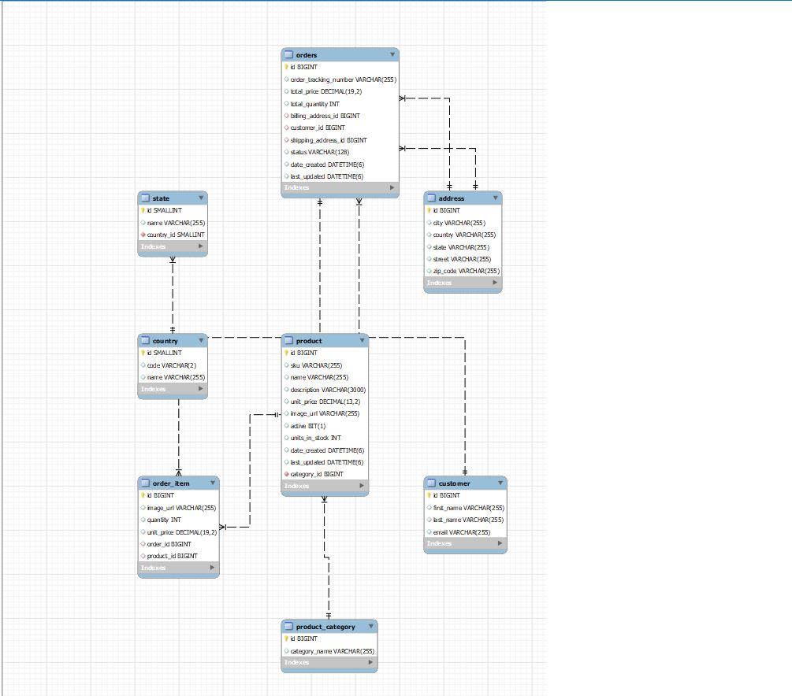

# deep-discount-online-store

# DEEP-DISCOUNT-ONLINE-STORE

## Table of Contents

- [Description](#Description)

- [Database](#Database)

- [Installation](#Installation)

- [Instructions](#Instructions)

- [License](#License)

- [Contribute](#Contribute)

- [Tests](#Tests)

- [Questions](#Questions)

- [Improvements](#Improvements)

- [General](#General)

## Description

This is a angular front end for DeepDiscountOnlineStore. Backend is done usign Java Spring Boot. Using this app, one can browse books by category, search by partial name, add books to shopping cart, view shopping cart, checkout shoping cart, supply customer, shipping address, billng address, credit card info and complete the purchase.  The back end will process the order and generate a order confirmation.  The back end will also update all the relevant tables and maintain Order info in database. 

## Database

To get an overview of tables take a  look at the ER diagram below: MySQL and spring boot hibernate is used to realize the database needs.

## Installation

clone the repository , open in IntelliJ or Eclipse and  run the maven project.

## Instructions

It has pretty intuitive UI easy to use spring  boot application. No other special  instruction  needed

## License

This project is licensed under the [ISC](https://opensource.org/licenses/ISC) License.

## Contribute

Please use my e-mail to contact me on how to contribute to this project.

## Tests

There are no automated tests written for this app.

## Questions

https://github.com/s-suresh-kumar
suresh01@yahoo.com

## Improvements

I  would like to integrate the payment processing to this app as  a next step.

Also the login functionality is broken, need to come up with a better security front end in the next iteration of the app.

## General

This project was generated with Spring Boot Initializr ( start.sprint.io)

